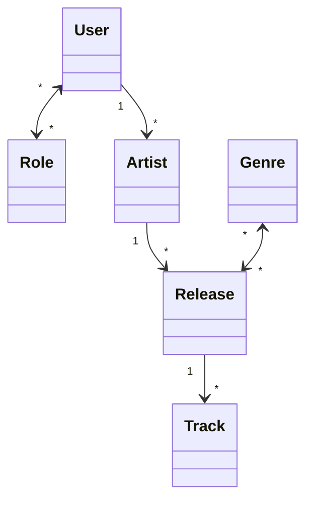
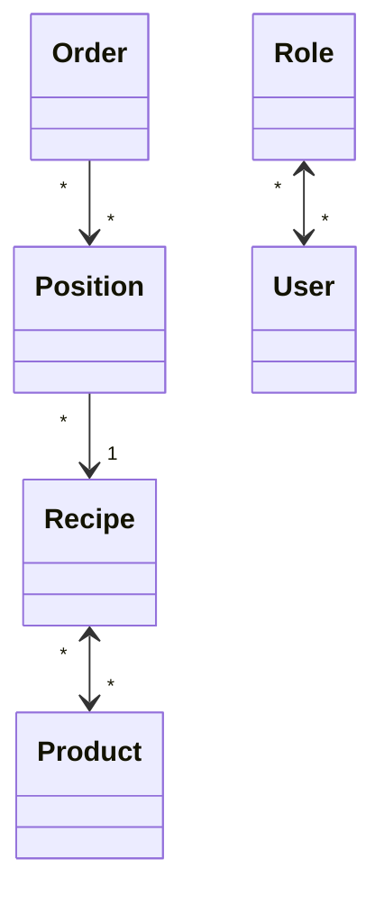
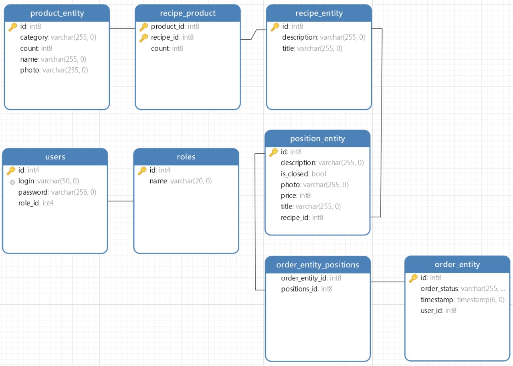

# Лабораторная работа 1

Написать монолит с использованием Spring boot. 

Разрешены языки: `Java`, `Kotlin`

Разрешены системы сборки: `Maven`, `Gradle`

## Требования к ходу разработки
- [ ] При разработке использовать `git feature branching strategy`.
- [ ] При выборе имен для коммитов необходимо придерживаться `git conventional commits`. 


### Требования
- [ ] Основные сущности должны иметь осмысленный CRUD интерфейс с использованием REST API.
- [ ] Использовать правильные `http` статусы для ответов.
- [ ] Для запросов к БД использовать `spring-data-jpa`.
- [ ] Должна быть реализована валидация полей на уровне контроллера и на уровне `Entity`.
- [ ] Структура БД должна создаваться через `Liquibase` миграции.
- [ ] Для каждого контроллера должны быть написаны интеграционные тесты с использованием `testcontainers` и `junit-jupiter-api`. 
- [ ] Использовать переменные среды для конфигурации приложения. При развертывании их можно задавать через поле `enviroments:` в `docker-compose.yml`.
- [ ] Приложение должно собираться с использованием `docker` и запускаться через `docker-compose`.
- [ ] Использовать БД `postgresql`, запущенную через `docker`.
- [ ] Каждый `findAll` должен иметь пагинацию. Нельзя отдавать больше 50 записей за один запрос.
- [ ] Должен быть минимум один запрос, который вернет `findAll` в виде бесконечной прокрутки без указания общего количества записей.
> Формат бесконечной пагинации
```json
{
  "items": [{
    "id": ...
    ...
  }, ...],
  "hasMore": false
}
```
- [ ] Должен быть минимум один запрос, который вернет `findAll` с пагинацией и с указанием общего количества записей в `http` хедере.
- [ ] На сложных запросах должны использоваться транзакции. Должно быть не меньше двух подобных запросов. Обосновать почему там нужны тразакции.
- [ ] Разделять модели `Entity` и `Dto`.
- [ ] Приложение должно иметь чистый код и архитектуру с разделением по сервисам, репозиториям, контроллерам, моделям, енамам и т. п. 
- [ ] Все енамы в БД должны сериализоваться как строки.
- [ ] Ошибки(Exception) из контроллеров нужно хендлить и отдавать человеко читаемую ошибку в теле ответа.  
### Требования к авторизации

- [ ] Авторизация должна быть.
- [ ] для авторизации использовать `spring-security` в комбинации с `JWT` токеном в хедере `Authorization`.
- [ ] Реализовать ролевую модель.
- [ ] Должны быть методы, логика которых меняется в зависимости от текущего пользователя. Пример: Повар не может загружать товары на склад, а логист не может принимать заказы у пользователей.
- [ ] Не отдавать пароль в запросе, где участвуют модели пользователя.
- [ ] Все пароли должны храниться в хэшированном виде.
- [ ] Пользователей могут создавать только супервайзеры (как в энтерпрайзе).

## Архитектура БД
- [ ] Согласовать архитектуру БД с преподавателем. 
- [ ] Должны быть реализованы связи между сущностями каждого типа: `Many to Many`, `One to Many/Many to One`, `Many to Many` с дополнительным полем.

Примеры архитектуры БД приведены на рисунках ниже.

### Артисты



### Система заказов



> В изготовлении рецепта `receipt_id` используется `count` продуктов типа `product_id`.
> На рисунке ниже изображена диграмма, полученная из navicat, которая описывает систему заказов.


