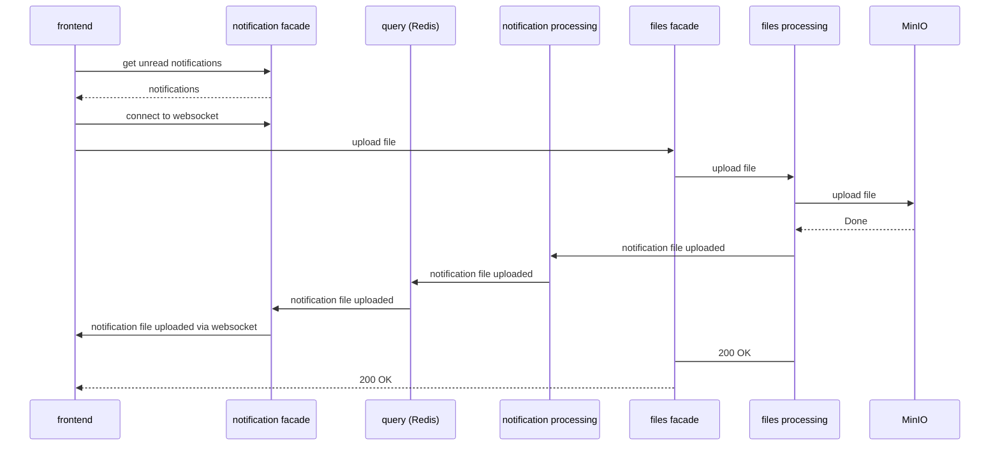

## Лабораторная работа 4

Реализовать
- [ ] Микросервис для работы с уведомлениями
- [ ] Микросервис для загрузки и получения файлов.

Использовать вебсокеты и очереди сообщений.

Когда пользователь загружает файл, при помощи websockets он должен получить уведомление от `Notification Processing Service` (как на диаграмме)

